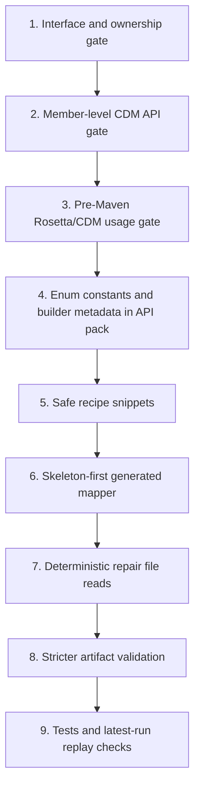

# Java Generator Agent Implementation Plan

Date: 2026-05-09
Status: implemented
Source research: `docs/java-generator-agent-research.md`

## Goal

Make the Java generator reliable without changing models. The agent should stop treating CDM/Rosetta evidence as advisory prose and start using it as hard generation rails:

- exact shell method signatures
- exact enum constants
- exact nested builder class names
- exact builder method signatures
- stronger pre-Maven CDM/Rosetta Java usage validation
- post-runtime Rosetta `RosettaTypeValidator` validation preserved as final semantic authority
- compile-checked recipe snippets
- repair phases that must read and patch affected files

This plan intentionally does not implement the changes yet. It describes the implementation sequence, target files, expected tests, and representative code snippets.

## Implementation Order



The order matters: start with gates that expose failures clearly, add the pre-Maven Rosetta/CDM usage layer, then improve the evidence the LLM sees, constrain generation, and finally constrain repair.

## Phase 1: Interface And Ownership Gate

Status: completed

### Problem

The latest run passed `generated-implementation-contract`, but Maven later failed because generated classes implemented the shell interface incorrectly:

- `GeneratedFpmlToCdmMapper.mapFile(...)` returned `TradeState`, not `String`.
- `PartyMapper` implemented `FpmlToCdmMapper` even though helper mappers should not implement the shell interface.

### Target Files

- `src/java-generator-agent/generated-implementation-contract.ts`
- `src/java-generator-agent/gates.ts`
- `test/java-generator-agent/generated-implementation-contract.test.ts`

### Design

Extend the existing implementation contract gate so it validates source-level interface conformance before Maven.

Rules:

- `GeneratedFpmlToCdmMapper.java` must exist.
- It must declare `public class GeneratedFpmlToCdmMapper implements FpmlToCdmMapper`.
- It must define a `mapFile` method returning `String`.
- No helper class under `src/main/java/com/fpml/cdm/fx/mapper/generated/` may implement `FpmlToCdmMapper`.
- No generated class may define `mapFile` returning anything other than `String`.

### Proposed Snippet

```ts
type ImplementationContractFinding = {
  file: string
  line: number
  code: string
  message: string
}

function findInterfaceConformanceFindings(args: {
  root: string
  generatedJavaFiles: string[]
}): ImplementationContractFinding[] {
  const findings: ImplementationContractFinding[] = []

  for (const file of args.generatedJavaFiles) {
    const source = readSource(file)
    const className = classNameFromFile(file)
    const implementsShell = /\bimplements\s+FpmlToCdmMapper\b/u.test(source)

    if (className !== 'GeneratedFpmlToCdmMapper' && implementsShell) {
      findings.push({
        file: relative(args.root, file),
        line: firstMatchingLine(source, /\bimplements\s+FpmlToCdmMapper\b/u),
        code: 'helper_implements_shell_interface',
        message: 'Only GeneratedFpmlToCdmMapper may implement FpmlToCdmMapper.',
      })
    }

    for (const match of source.matchAll(/\bpublic\s+([A-Za-z0-9_$.<>]+)\s+mapFile\s*\(/gmu)) {
      const returnType = match[1]
      if (returnType !== 'String') {
        findings.push({
          file: relative(args.root, file),
          line: lineForIndex(source, match.index),
          code: 'invalid_map_file_return_type',
          message: `mapFile must return String, found ${returnType}.`,
        })
      }
    }
  }

  return findings
}
```

### Tests

Add fixtures that assert failures for:

- `TradeState mapFile(...)`
- helper class implementing `FpmlToCdmMapper`
- missing `GeneratedFpmlToCdmMapper`
- valid generated entry class

## Phase 2: CDM Java Member Usage Gate

Status: completed

### Problem

`cdm-java-api-usage` validates class-level references but not member-level use. The latest generated Java imported approved enum classes but invented constants and nested builder types.

### Target Files

- New: `src/java-generator-agent/cdm-java-member-usage.ts`
- `src/java-generator-agent/gates.ts`
- New: `test/java-generator-agent/cdm-java-member-usage.test.ts`

### Design

Add a diagnostic gate before Maven:

```ts
pushGateResult(results, await runCdmJavaMemberUsageGate(config))
```

Place it after `cdm-java-api-usage` and before `builder-readiness-usage`.

It should validate:

- enum constants, e.g. `TradeIdentifierTypeEnum.TRADE_ID`
- generic `.Builder` nested type assumptions, e.g. `TradeIdentifier.Builder`
- builder method calls when the receiver type can be determined simply

Start with enum constants and nested builders; method argument-shape analysis can follow once the basic gate is stable.

### Proposed Finding Type

```ts
export type CdmJavaMemberUsageFinding = {
  file: string
  line: number
  code:
    | 'unknown_enum_constant'
    | 'unknown_nested_builder_type'
    | 'unknown_builder_method'
  className: string
  memberName: string
  message: string
}
```

### Proposed Enum Check

```ts
function findEnumConstantFindings(args: {
  sourceText: string
  file: string
  root: string
  importedClasses: Map<string, string>
  enumConstantsByClass: Map<string, Set<string>>
}): CdmJavaMemberUsageFinding[] {
  const findings: CdmJavaMemberUsageFinding[] = []
  const stripped = stripJavaCommentsAndLiterals(args.sourceText)

  for (const match of stripped.matchAll(/\b([A-Z][A-Za-z0-9_]*Enum)\s*\.\s*([A-Z][A-Z0-9_]*)\b/gmu)) {
    const simpleName = match[1]
    const constant = match[2]
    if (simpleName === undefined || constant === undefined) continue

    const className = args.importedClasses.get(simpleName)
    if (className === undefined) continue

    const constants = args.enumConstantsByClass.get(className)
    if (constants === undefined || constants.has(constant)) continue

    findings.push({
      file: relative(args.root, args.file),
      line: lineForIndex(stripped, match.index),
      code: 'unknown_enum_constant',
      className,
      memberName: constant,
      message: `${className}.${constant} is not present in the compiled CDM Java jar.`,
    })
  }

  return findings
}
```

### Proposed Nested Builder Check

```ts
function findNestedBuilderFindings(args: {
  sourceText: string
  file: string
  root: string
  importedClasses: Map<string, string>
  builderClassByClass: Map<string, string>
}): CdmJavaMemberUsageFinding[] {
  const findings: CdmJavaMemberUsageFinding[] = []

  for (const match of args.sourceText.matchAll(/\b([A-Z][A-Za-z0-9_]*)\.Builder\b/gmu)) {
    const simpleName = match[1]
    if (simpleName === undefined) continue

    const className = args.importedClasses.get(simpleName)
    if (className === undefined) continue

    const actualBuilder = args.builderClassByClass.get(className)
    if (actualBuilder === `${className}$Builder`) continue

    findings.push({
      file: relative(args.root, args.file),
      line: lineForIndex(args.sourceText, match.index),
      code: 'unknown_nested_builder_type',
      className,
      memberName: `${simpleName}.Builder`,
      message: `Use the exact builder type from javap, for example ${actualBuilder}, or avoid declaring the builder type.`,
    })
  }

  return findings
}
```

### Tests

Use small Java source strings to assert:

- `TradeIdentifierTypeEnum.TRADE_ID` fails.
- `TradeIdentifierTypeEnum.UNIQUE_TRANSACTION_IDENTIFIER` passes.
- `PartyIdentifierTypeEnum.BANK_WIRE_TRANSMIT` fails.
- `TradeIdentifier.Builder` fails when class details say `TradeIdentifier$TradeIdentifierBuilder`.

## Phase 3: Pre-Maven Rosetta/CDM Usage Gate

Status: completed

### Problem

The repo already has a real Rosetta validator CLI in `rosetta-validator/src/main/java/com/fpml/validator/RosettaValidatorCli.java`, and `runGates` invokes it as `rosetta-validation:<fixture-id>`. That validator deserializes generated CDM JSON with `RosettaObjectMapper`, runs `ReferenceResolverProcessStep`, and then runs `RosettaTypeValidator`.

However, this full validator can only run after the generated mapper compiles, packages, runs against fixtures, and emits JSON. In the latest run it was skipped because `maven-compile` failed first.

We should not move the full output validator earlier. Instead, add a pre-Maven Rosetta/CDM Java usage gate that checks whether generated Java is using the CDM/Rosetta package in ways that are known to be valid before Maven has to discover the problem.

### Target Files

- New: `src/java-generator-agent/rosetta-java-usage-gate.ts`
- `src/java-generator-agent/gates.ts`
- `src/java-generator-agent/cdm-java-member-usage.ts`
- `src/java-generator-agent/final-implementation-contract.ts`
- New: `test/java-generator-agent/rosetta-java-usage-gate.test.ts`

### Design

The new gate should be diagnostic but pre-Maven. It should combine the local CDM API facts, approved API contract, final implementation contract, and Rosetta validator semantics into one report.

It should validate:

- generated output root is intended to be `TradeState`
- generated Java builds CDM model objects, not JSON trees, as the main representation
- generated Java uses only approved CDM/Rosetta classes
- generated Java uses known enum constants
- generated Java uses known builder class names and builder methods
- generated Java does not directly build `parameter_only` classes
- generated Java contains a runtime path that serializes CDM model objects with Jackson/Rosetta-compatible serialization
- generated Java does not call the Rosetta validator at runtime
- sidecar reports are separate from the main CDM JSON

This gate should explicitly report that full `RosettaTypeValidator` output validation remains post-runtime authority.

### Proposed Gate Result

```ts
export type RosettaJavaUsageFinding = {
  file: string
  line: number
  code:
    | 'main_output_not_cdm_model'
    | 'missing_trade_state_root'
    | 'jackson_tree_as_cdm_model'
    | 'unknown_cdm_enum_constant'
    | 'unknown_cdm_builder_member'
    | 'parameter_only_builder_usage'
    | 'runtime_validator_call'
    | 'mixed_report_and_cdm_output'
  severity: 'error' | 'warning'
  message: string
}
```

### Proposed Gate Skeleton

```ts
export async function runRosettaJavaUsageGate(config: GeneratorRunConfig): Promise<GateResult> {
  const findings = await findRosettaJavaUsageFindings(config.runOutputDir)
  const reportPath = resolve(config.runOutputDir, 'build-reports', 'rosetta-java-usage.json')
  await mkdir(dirname(reportPath), { recursive: true })
  await writeFile(reportPath, JSON.stringify({
    authority: 'pre-maven-diagnostic',
    finalSemanticAuthority: 'post-runtime rosetta-validation gates using RosettaTypeValidator',
    findings,
  }, null, 2), 'utf8')

  const errors = findings.filter(finding => finding.severity === 'error')
  return {
    name: 'rosetta-java-usage',
    command: 'diagnose generated Java for valid CDM/Rosetta package usage before Maven',
    status: errors.length === 0 ? 'passed' : 'failed',
    exitCode: errors.length === 0 ? 0 : 1,
    outputSnippet: errors.length === 0
      ? 'Pre-Maven Rosetta/CDM Java usage diagnostic passed.'
      : JSON.stringify(errors.slice(0, 60), null, 2),
  }
}
```

### Proposed Integration

In `runGates`, place the gate before Maven and after the lower-level API/member checks:

```ts
pushGateResult(results, await runCdmJavaApiUsageGate(config))
pushGateResult(results, await runCdmJavaMemberUsageGate(config))
pushGateResult(results, await runRosettaJavaUsageGate(config))
pushGateResult(results, await runGeneratedTestShellContractGate(config))
pushGateResult(results, await runBuilderReadinessUsageGate(config))
```

### Prompt Context To Add

Add a concise validator contract to the implementer and repair prompts:

```text
The final generated JSON will be validated after runtime by the repo-local Rosetta validator:
RosettaObjectMapper -> TradeState/Trade builder -> ReferenceResolverProcessStep -> RosettaTypeValidator.
Do not call this validator from generated runtime code.
Generate CDM/Rosetta Java model objects as the main representation, then serialize only at the boundary.
Pre-Maven gates will reject invalid CDM/Rosetta usage such as unknown enum constants, unknown builder members, parameter-only builders, and JSON-tree CDM construction.
```

### Tests

Add reduced Java fixtures that assert the gate fails on:

- `ObjectNode` or `ArrayNode` used as the main CDM model
- `RosettaValidatorCli` or `RosettaTypeValidator` called by generated runtime code
- missing `TradeState` root construction
- unknown enum constants
- parameter-only builder usage
- main output combining sidecar report text with CDM JSON

Add positive fixtures for:

- `TradeState.builder().setTrade(trade).build()`
- Jackson serialization at the `mapFile` boundary
- sidecar report written separately under `reportsDir`

### Acceptance Criteria

- The current post-runtime `rosetta-validation:<fixture-id>` gates stay in place.
- The new pre-Maven gate catches the latest run's CDM/Rosetta usage failures before `maven-compile`.
- The new gate report explains that full semantic validation still requires generated runtime JSON.

## Phase 4: API Pack Metadata Improvements

Status: completed

### Problem

The LLM sees approved classes and methods, but not enough compact member facts. Enum constants are hidden unless it calls the right detail tool and reads carefully.

### Target Files

- `src/java-generator-agent/cdm-java-api-pack.ts`
- `src/java-generator-agent/approved-cdm-api-contract.ts`
- `test/java-generator-agent/cdm-java-api-pack.test.ts`
- `test/java-generator-agent/accepted-plan.test.ts` if summaries are machine-checked there

### Design

Add enum constants and builder class names to the class detail model and approved contract summary.

Desired summary output:

```md
## Approved Enum Constants

- cdm.base.staticdata.identifier.TradeIdentifierTypeEnum:
  - UNIQUE_TRANSACTION_IDENTIFIER
  - UNIQUE_SWAP_IDENTIFIER
- cdm.base.staticdata.party.PartyIdentifierTypeEnum:
  - BIC
  - LEI
  - MIC

## Approved Builder Classes

- cdm.event.common.TradeIdentifier:
  - builder type: cdm.event.common.TradeIdentifier.TradeIdentifierBuilder
- cdm.base.staticdata.identifier.AssignedIdentifier:
  - builder type: cdm.base.staticdata.identifier.AssignedIdentifier.AssignedIdentifierBuilder
```

### Proposed Contract Shape

```ts
export type ApprovedCdmClass = {
  className: string
  simpleName: string
  packageName: string
  builderClassName?: string
  enumConstants?: string[]
  implementationRule?: 'construct_directly' | 'parameter_only' | 'reference_only'
}
```

### Proposed Rendering Snippet

```ts
function renderApprovedEnumConstants(contract: ApprovedCdmApiContract): string {
  const enumClasses = contract.approvedClasses.filter(item => (item.enumConstants ?? []).length > 0)
  if (enumClasses.length === 0) return '- none'

  return enumClasses
    .map(item => [
      `- ${item.className}:`,
      ...(item.enumConstants ?? []).map(constant => `  - ${constant}`),
    ].join('\n'))
    .join('\n')
}
```

### Tests

Assert the summary includes:

- `UNIQUE_TRANSACTION_IDENTIFIER`
- `UNIQUE_SWAP_IDENTIFIER`
- `BIC`
- `LEI`
- `MIC`
- `TradeIdentifierBuilder`

## Phase 5: Safe Recipe Snippets

Status: completed

### Problem

`semantic-recipes.md` currently gives method indexes. The LLM needs compile-checked implementation patterns it can copy.

### Target Files

- `src/java-generator-agent/semantic-recipes.ts`
- `src/java-generator-agent/semantic-recipe-fixtures.ts`
- `test/java-generator-agent/semantic-recipes.test.ts`
- `test/java-generator-agent/semantic-recipe-fixtures.test.ts`

### Design

Extend each recipe step with a `safeJavaSnippet` field generated from approved classes and methods.

The snippets should be minimal, compile-checked, and honest. If a class is `parameter_only`, the snippet should show omission or a blocker note, not direct construction.

### Proposed Type

```ts
export type SemanticRecipeStep = {
  id: string
  title: string
  core: boolean
  approvedClasses: string[]
  requiredBuilderIntents: string[]
  approvedBuilderMethods: ApprovedBuilderMethod[]
  rosettaFunctions: string[]
  notes: string[]
  safeJavaSnippet?: string
}
```

### Example Snippets

Party identifier:

```java
AssignedIdentifier assignedIdentifier = AssignedIdentifier.builder()
    .setIdentifierValue(partyIdValue)
    .build();

PartyIdentifier partyIdentifier = PartyIdentifier.builder()
    .setIdentifierValue(partyIdValue)
    .setIdentifierType(PartyIdentifierTypeEnum.LEI)
    .build();

Party party = Party.builder()
    .addPartyId(partyIdentifier)
    .build();
```

Trade identifier:

```java
AssignedIdentifier assignedIdentifier = AssignedIdentifier.builder()
    .setIdentifierValue(tradeIdValue)
    .build();

TradeIdentifier tradeIdentifier = TradeIdentifier.builder()
    .addAssignedIdentifier(assignedIdentifier)
    .setIdentifierType(TradeIdentifierTypeEnum.UNIQUE_TRANSACTION_IDENTIFIER)
    .build();
```

Trade state:

```java
Trade trade = Trade.builder()
    .setProduct(nonTransferableProduct)
    .build();

TradeState tradeState = TradeState.builder()
    .setTrade(trade)
    .build();
```

Parameter-only class warning:

```md
ContractDetails is approved as a parameter type only in this run. Do not call ContractDetails.builder().
If contract details are required, stop and report a contract gap or update the approved API contract from javap evidence.
```

### Tests

- Recipe fixture generation must compile the snippets.
- No snippet may contain `.Builder`.
- No snippet may reference unknown enum constants.
- No snippet may call `.builder()` on `parameter_only` classes.

## Phase 6: Skeleton-First Generated Mapper

Status: completed

### Problem

The model currently owns the entire generated entry class. It can accidentally redesign the shell boundary.

### Target Files

- `src/java-generator-agent/java-shell.ts` or new `src/java-generator-agent/generated-skeleton.ts`
- `src/java-generator-agent/orchestrator.ts`
- `test/java-generator-agent/java-shell.test.ts`
- `test/java-generator-agent/generated-implementation-contract.test.ts`

### Design

Create a compile-safe `GeneratedFpmlToCdmMapper.java` before the implementer runs. The implementer can replace the body, but starts from a valid shell-compatible class.

The skeleton should:

- implement `FpmlToCdmMapper`
- return `String`
- parse XML with DOM
- serialize a CDM `TradeState`
- write a minimal unsupported report when mapping is incomplete
- avoid direct construction of parameter-only classes

### Proposed Skeleton

```java
package com.fpml.cdm.fx.mapper.generated;

import cdm.event.common.Trade;
import cdm.event.common.TradeState;
import com.fasterxml.jackson.databind.ObjectMapper;
import com.fpml.cdm.fx.mapper.FpmlToCdmMapper;
import java.nio.file.Files;
import java.nio.file.Path;
import javax.xml.parsers.DocumentBuilderFactory;
import org.w3c.dom.Document;

public class GeneratedFpmlToCdmMapper implements FpmlToCdmMapper {
    private final ObjectMapper objectMapper = new ObjectMapper();

    @Override
    public String mapFile(Path inputPath, Path reportsDir) throws Exception {
        Files.createDirectories(reportsDir);
        Document document = DocumentBuilderFactory.newInstance()
            .newDocumentBuilder()
            .parse(inputPath.toFile());
        TradeState tradeState = mapTradeState(document, reportsDir);
        return objectMapper.writeValueAsString(tradeState);
    }

    private TradeState mapTradeState(Document document, Path reportsDir) throws Exception {
        writeUnsupportedReport(reportsDir, "Generated skeleton has not implemented full FX mapping yet.");
        Trade trade = Trade.builder().build();
        return TradeState.builder().setTrade(trade).build();
    }

    private void writeUnsupportedReport(Path reportsDir, String message) throws Exception {
        Files.writeString(reportsDir.resolve("unsupported-fields-report.json"),
            "{\"status\":\"unsupported\",\"message\":\"" + message + "\"}");
    }
}
```

### Prompt Change

In `IMPLEMENTER_SYSTEM_PROMPT`, replace "write the main class" with:

```text
GeneratedFpmlToCdmMapper.java already exists as a compile-safe skeleton.
Preserve its package, class name, interface, and mapFile signature.
Patch method bodies and add helper classes only when needed.
Helper classes must not implement FpmlToCdmMapper.
```

### Tests

- A fresh Java shell should contain the skeleton.
- Skeleton should pass `mvn -q -DskipTests compile`.
- Implementation contract gate should pass on the skeleton.

## Phase 7: Deterministic Repair File Reads

Status: completed

### Problem

The repair role said files were missing instead of calling `read_file`.

### Target Files

- `src/java-generator-agent/orchestrator.ts`
- `src/java-generator-agent/repair-focus.ts`
- `src/java-generator-agent/implementation-artifacts.ts`
- `test/java-generator-agent/repair-focus.test.ts`
- `test/java-generator-agent/implementation-artifacts.test.ts`

### Design

Make repair source inspection enforceable.

Add to `repair-focus.ts`:

- run-relative paths for each affected file
- absolute path as secondary debug context
- a machine-readable JSON packet with affected files

### Proposed Repair Packet Shape

```ts
export type RepairFocusPacket = {
  attempt: number
  earliestFailedGate: string
  category: string
  failedGateOutput: string
  affectedFiles: Array<{
    runRelativePath: string
    absolutePath: string
    lines: Array<{ line: number; text: string }>
  }>
}
```

### Proposed Policy

In `runRepair`, compute required reads:

```ts
const affectedJavaFiles = packet.affectedFiles
  .map(file => file.runRelativePath)
  .filter(path => path.endsWith('.java'))

const researchRun = await runRole({
  // ...
  toolCallPolicy: {
    pseudoToolCallsAreFatal: true,
    requiredToolNames: ['read_file'],
    requiredReadPaths: affectedJavaFiles,
  },
})
```

If `ToolCallPolicy` does not currently support `requiredReadPaths`, add it to `tool-runner.ts` policy validation.

### False Blocker Detection

In `validateImplementationArtifacts`, fail repair output if:

- repair write was required
- no write happened
- output asks the user to provide generated source files

Proposed detection:

```ts
const asksForExistingGeneratedFiles =
  /please provide/i.test(roleOutput)
  && /src\/main\/java\/com\/fpml\/cdm\/fx\/mapper\/generated/i.test(normalizeSeparators(roleOutput))

if (role === 'repair' && repairWriteRequirement?.required && asksForExistingGeneratedFiles) {
  findings.push('Repair asked user to provide generated files that are readable inside the run workspace.')
}
```

### Tests

- Repair artifact validation fails on "please provide TradeIdentifierMapper.java".
- Repair focus packet includes run-relative affected file paths.
- Tool policy fails if affected Java files are not read.

## Phase 8: Stricter Implementation Artifact Validation

Status: completed

### Problem

The implementer claimed a broad manifest with classes it did not actually write. The run wrote only three generated classes, while the manifest listed many.

### Target Files

- `src/java-generator-agent/implementation-artifacts.ts`
- `test/java-generator-agent/implementation-artifacts.test.ts`

### Design

Validate that role claims match tool writes.

Checks:

- Every generated Java file named in the implementer manifest must either be written or explicitly marked "planned but not implemented".
- Required entry class must be written or already exist from skeleton.
- If write phase claims success but writes no generated Java, fail.
- If source has shell signature violations, fail immediately.
- If source uses parameter-only direct builders, fail before gate loop.

### Proposed Snippet

```ts
function extractClaimedGeneratedJavaFiles(markdown: string): string[] {
  const files = new Set<string>()
  for (const match of markdown.matchAll(/`([^`]+\.java)`/gmu)) {
    const path = normalizeSeparators(match[1] ?? '')
    if (path.includes('/generated/') || /^[A-Z][A-Za-z0-9_]*\.java$/u.test(path)) {
      files.add(path)
    }
  }
  return [...files]
}

function validateClaimedFilesWereWritten(args: {
  claimedFiles: string[]
  writtenPaths: string[]
}): string[] {
  const findings: string[] = []
  const written = new Set(args.writtenPaths.map(normalizeSeparators))

  for (const claimed of args.claimedFiles) {
    const normalized = claimed.includes('/')
      ? claimed
      : `src/main/java/com/fpml/cdm/fx/mapper/generated/${claimed}`
    if (!written.has(normalized)) {
      findings.push(`Implementation claimed ${claimed}, but no write tool call wrote that file.`)
    }
  }

  return findings
}
```

### Tests

- Manifest claims `ProductMapper.java`, but write audit lacks it: fail.
- Manifest claims only written files: pass.
- Repair required but no write call: fail.

## Phase 9: Gate Integration And Test Strategy

Status: completed

### Gate Order

Target `runGates` ordering:

```ts
pushGateResult(results, await runGeneratedImplementationContractGate(config))
pushGateResult(results, await runSourceHygieneGate(config))
pushGateResult(results, await runGeneratedJavaStaticSanityGate(config))
pushGateResult(results, await runJavaReferenceGate(config))
pushGateResult(results, await runCdmJavaApiUsageGate(config))
pushGateResult(results, await runCdmJavaMemberUsageGate(config))
pushGateResult(results, await runGeneratedTestShellContractGate(config))
pushGateResult(results, await runBuilderReadinessUsageGate(config))
```

### Unit Tests To Add

- `cdm-java-member-usage.test.ts`
- `generated-implementation-contract.test.ts` additions
- `repair-focus.test.ts` additions
- `implementation-artifacts.test.ts` additions
- `semantic-recipes.test.ts` additions

### Regression Fixture From Latest Run

Add a test fixture using reduced versions of the latest bad files:

- `GeneratedFpmlToCdmMapper` with `TradeState mapFile`
- `PartyMapper implements FpmlToCdmMapper`
- `TradeIdentifierTypeEnum.TRADE_ID`
- `PartyIdentifierTypeEnum.BANK_WIRE_TRANSMIT`
- `TradeIdentifier.Builder`
- `ContractDetails.builder()`

Expected:

- interface gate catches wrong `mapFile` and helper interface ownership
- member usage gate catches enum constants and nested builder
- builder readiness gate catches parameter-only direct builders

## Acceptance Criteria

The work is done when:

- Existing TypeScript typecheck passes.
- Existing Java generator agent tests pass.
- New tests cover all latest-run failure modes listed above.
- A new Java generator run no longer reaches Maven with:
  - wrong `mapFile` return type
  - helper mappers implementing `FpmlToCdmMapper`
  - unknown enum constants
  - `SomeCdmClass.Builder` guesses
  - direct `.builder()` calls on `parameter_only` classes
- Repair cannot ask the user to provide generated files that are readable in the run workspace.

## Risks And Mitigations

| Risk | Impact | Mitigation |
|---|---|---|
| Regex gates overfit Java syntax | False positives or missed cases | Start with simple latest-run patterns; keep Maven authoritative |
| Skeleton constrains implementation too much | LLM may patch around it awkwardly | Keep skeleton minimal and allow helper classes |
| Member usage gate becomes complex | Slows implementation | Phase enum constants and nested builders first; defer argument-shape inference |
| More gates increase repair workload | More diagnostic noise | Keep failure snippets focused and ordered by earliest actionable gate |
| Snippets become stale | LLM copies bad examples | Generate snippets from `approved-cdm-api-contract.json` and compile-check fixtures |

## Suggested Rollout

1. Implement Phase 1 and Phase 2 together, because they catch the latest compile blockers fastest.
2. Add Phase 6 repair enforcement before running another expensive LLM generation.
3. Add Phase 3 and Phase 4 to improve future generation quality.
4. Add Phase 5 skeleton-first once the gates prove the desired source shape.
5. Finish with Phase 7 validation tightening and a full generator run.

## Final Notes

Do not start by changing the model. The latest run already had the needed knowledge on disk. The priority is to make the system impossible to ignore: exact source skeletons, exact CDM member metadata, pre-Maven gates, and repair policies that force the model to inspect the files it is supposed to patch.
