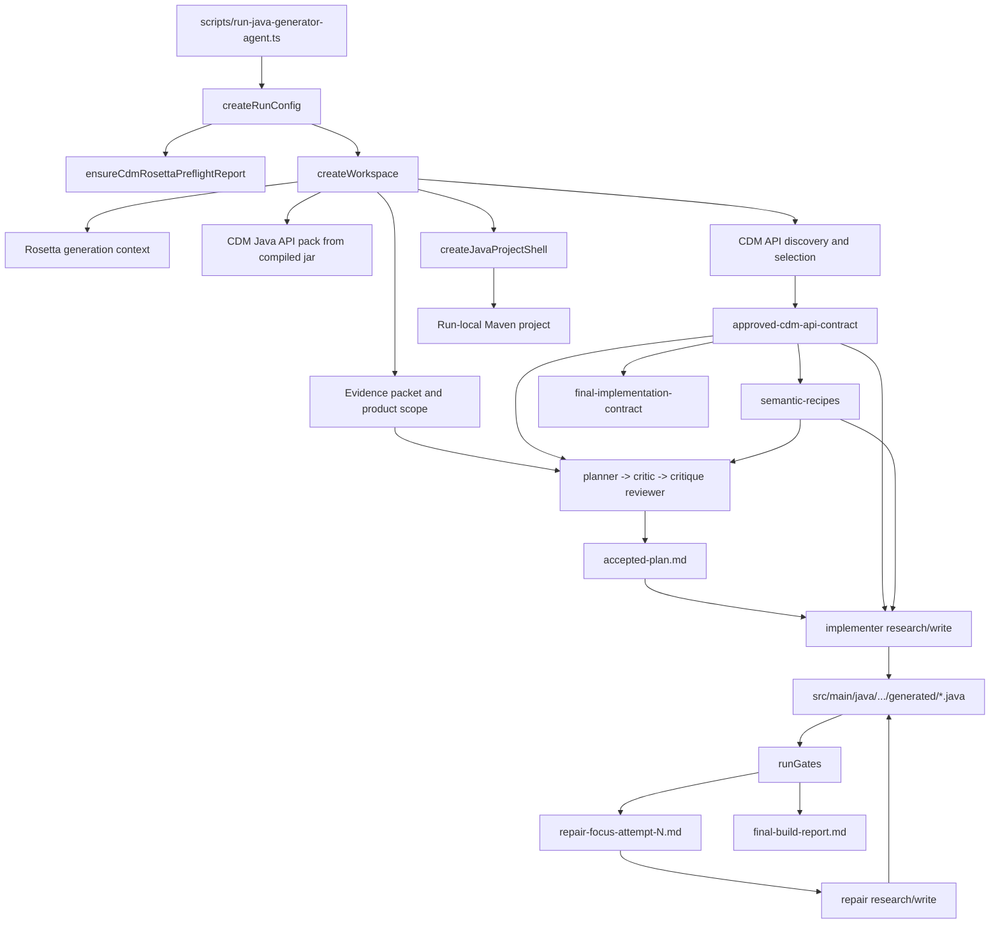
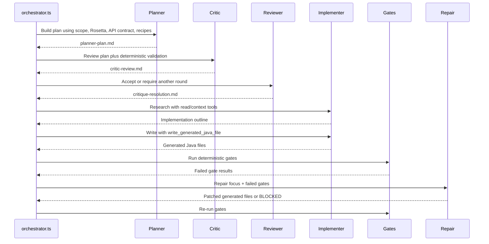
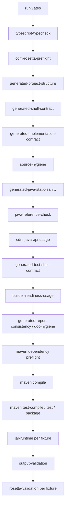
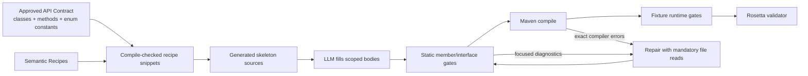

# Java Generator Agent Research

Date: 2026-05-09
Latest run analysed: `generated/java-mapper-poc/runs/2026-05-09T12-43-06-588Z`
Product family: `fx-derivatives`
Implementation group: `fx-single-leg`

## Executive Summary

The Java generator agent is a multi-role LLM pipeline that builds a run-local Maven project, generates CDM/Rosetta-backed Java mapper code, runs deterministic gates, and asks a repair role to patch failures. The latest run reached planning acceptance quickly, but the produced Java never compiled. The final blocking gates were:

- `generated-java-static-sanity`
- `builder-readiness-usage`
- `maven-compile`

The strongest current parts are the deterministic workspace setup, CDM/Rosetta preflight, approved API contract generation, semantic recipe generation, and gate suite. The weakest part is the connection between those artifacts and the actual Java source written by the implementer and repair roles. The agent has the right tools, but it does not force the model to use them in the right order or validate the source against enough exact Java API facts before Maven.

The latest output failed because the generated code:

- Implemented `FpmlToCdmMapper.mapFile(Path, Path)` with `TradeState` instead of the shell-required `String`.
- Invented enum constants such as `TradeIdentifierTypeEnum.TRADE_ID`, `ISIN`, `SEDOL`, and `PartyIdentifierTypeEnum.BANK_WIRE_TRANSMIT`.
- Used non-existent nested builder names such as `TradeIdentifier.Builder` and `AssignedIdentifier.Builder` instead of the generated CDM builder class names.
- Misused CDM field shapes, for example treating `FieldWithMetaString` as a stream and setting `Identifier` where `FieldWithMetaString` is expected.
- Directly constructed classes that the final implementation contract marked `parameter_only`, including `ContractDetails`, `EconomicTerms`, and `ReferenceWithMetaParty`.
- Returned `null` silently in generated mapper methods.
- Failed repair because the repair model declared that source files were missing, even though the `read_file` tool could read them from the run root.

## Current Data Flow



## Runtime And Shell Contract

The generated Maven shell is deterministic and owned by `src/java-generator-agent/java-shell.ts`. It writes:

- `pom.xml`
- `src/main/java/com/fpml/cdm/fx/mapper/Main.java`
- `src/main/java/com/fpml/cdm/fx/mapper/RuntimeArgs.java`
- `src/main/java/com/fpml/cdm/fx/mapper/FpmlToCdmMapper.java`

The shell interface is:

```java
String mapFile(Path inputPath, Path reportsDir) throws Exception;
```

In the latest run, `GeneratedFpmlToCdmMapper` and `PartyMapper` implemented `mapFile` as returning `TradeState`, causing Maven compile errors. This means the prompt and gates check for the existence of the implementation class, but do not strongly enough prevent the model from overriding the interface with the wrong return type.

Missing fix:

- Strengthen `generated-implementation-contract` or add a pre-Maven AST/text gate that checks the exact generated method signature:
  `public String mapFile(Path inputPath, Path reportsDir) throws Exception`.
- Make `GeneratedFpmlToCdmMapper` the only generated class allowed to implement `FpmlToCdmMapper`; helper mappers should be plain classes.
- Add a small generated source skeleton for `GeneratedFpmlToCdmMapper` before the implementer runs, so the LLM fills methods rather than redesigning the shell boundary.

## Role Pipeline



The intended separation is good: planning does not write code, implementation has a read phase and a write phase, and repair has a read phase and a write phase. The latest run shows two breakdowns:

1. The implementer wrote Java that contradicted artifacts it had read.
2. The repair role had access to `read_file` but did not use it before declaring the source unavailable.

Missing fix:

- In `runRepair`, require at least one native `read_file` tool call for each Java file referenced by failed gates before the repair write phase can be considered valid.
- In repair instructions, explicitly say: "If the excerpt is insufficient, call `read_file` on the run-relative generated Java file. Do not ask the user to provide files."
- Treat `BLOCKED because source files are missing` as a repair policy failure when the files are under the run output directory.

## Tool Surface

The Java generator exposes these important tool groups:

- Evidence/context tools: `get_scope_evidence`, `get_context_packet`, `get_fixture_summary`, `get_expected_cdm_summary`
- Rosetta tools: `get_rosetta_generation_context`, `get_rosetta_mapping_area`, `get_rosetta_function`, `search_rosetta_blocks`
- CDM Java tools: `get_cdm_java_api_summary`, `search_cdm_java_classes`, `resolve_cdm_concept`, `get_cdm_java_class`, `get_cdm_builder_methods`, `get_approved_cdm_api_contract`, `get_cdm_java_missing_classes`
- Write tools: `write_generated_java_file`, `write_file`
- Build/runtime tool: `run_command`

The tools exist, but the latest run proves that "tool available" is not the same as "tool enforced." For example, the model queried enum classes during repair, but the generated source still used enum values that are not present in the compiled jar.

Actual jar evidence from `javap`:

- `TradeIdentifierTypeEnum` has `UNIQUE_TRANSACTION_IDENTIFIER` and `UNIQUE_SWAP_IDENTIFIER`.
- `PartyIdentifierTypeEnum` has `BIC`, `LEI`, and `MIC`.

Generated code used:

- `TradeIdentifierTypeEnum.TRADE_ID`
- `TradeIdentifierTypeEnum.ISIN`
- `TradeIdentifierTypeEnum.SEDOL`
- `PartyIdentifierTypeEnum.BANK_WIRE_TRANSMIT`

Missing fix:

- Extend `get_cdm_java_class` rendering for enums to include explicit enum constants in a compact, hard-to-miss section.
- Add a deterministic enum-constant usage gate: every `SomeEnum.X` reference in generated Java must be checked against `javap`/class-details constants.
- Add `get_cdm_enum_constants(className)` as a smaller, purpose-built tool.

## Gate Flow



The gate ordering is mostly right. The key issue is that several diagnostic gates are too shallow:

- `cdm-java-api-usage` checks imports and fully qualified class references against the approved contract, but it does not validate members, enum constants, nested builder type names, or method argument shapes.
- `builder-readiness-usage` catches direct `.builder()` calls on parameter-only classes, but not direct builder usage hidden behind type imports or invalid method chains.
- `generated-implementation-contract` passed even though the generated entry class did not satisfy the Java interface signature.
- Maven was the first authoritative gate to catch many issues that could be caught faster and fed into repair more precisely.

Missing fix:

- Add a `cdm-java-member-usage` gate for enum constants, nested builder class names, and builder method names.
- Add an interface conformance gate for `GeneratedFpmlToCdmMapper`.
- Add a CDM builder argument-shape gate using `approved-cdm-api-contract.json` method signatures.

## Latest Run Failure Map

| Failure | Latest evidence | Broken link | Fix direction |
|---|---|---|---|
| Wrong `mapFile` return type | Maven: return type `TradeState` is not compatible with `String` | Shell contract is known but not enforced on generated method signatures | Interface conformance gate and skeleton-first generation |
| Helper mappers implement shell interface | `PartyMapper implements FpmlToCdmMapper`, `TradeIdentifierMapper implements FpmlToCdmMapper` | Prompt says main class must implement interface, but does not forbid helpers from implementing it | Add rule/gate: only `GeneratedFpmlToCdmMapper` may implement `FpmlToCdmMapper` |
| Invented enum constants | Maven cannot find `TRADE_ID`, `ISIN`, `SEDOL`, `BANK_WIRE_TRANSMIT` | API contract approves enum classes, but not enum constants | Enum constants tool and gate |
| Wrong nested builder type names | Maven cannot find `TradeIdentifier.Builder`, `AssignedIdentifier.Builder` | Class detail evidence contains `$TradeIdentifierBuilder`, but generated code uses generic memory pattern | Gate against `.Builder` nested names for CDM classes unless exact nested class exists |
| Wrong CDM field shape | `FieldWithMetaString` used as stream; `Identifier` passed where `FieldWithMetaString` expected | Builder method signatures are present but not translated into examples | Generate canonical snippets per approved builder method |
| Parameter-only classes constructed | `ContractDetails.builder()`, `EconomicTerms.builder()`, `ReferenceWithMetaParty.builder()` | Final contract says `parameter_only`, but implementer still constructs them | Fail implementation artifact validation before Maven if parameter-only direct builders appear |
| Silent `return null` | Static sanity found null returns | Unsupported behavior policy is broad but no source template enforces it | Provide helper method/report pattern for unsupported fields |
| Repair stopped incorrectly | Repair log asks user to provide files | Repair role did not use available `read_file` | Require read-file calls for affected files; classify false "missing source" as policy failure |

## CDM API Contract Problems

The contract generation is useful but currently ambiguous in two ways.

First, approved classes are treated by the model as permission to use every visible member. That is unsafe for enums and generated builders. Approval of `TradeIdentifierTypeEnum` should not imply permission to invent `TRADE_ID`. Approval of `ReferenceWithMetaParty` should not imply permission to construct it directly when builder readiness says `parameter_only`.

Second, the builder method index shows method names and broad intents, but not enough "copyable correct usage." The model drifted into plausible Java like:

```java
TradeIdentifier.Builder builder = TradeIdentifier.builder();
```

The actual class detail uses:

```java
TradeIdentifier.TradeIdentifierBuilder builder = TradeIdentifier.builder();
```

or simply:

```java
TradeIdentifier tradeIdentifier = TradeIdentifier.builder()
    .addAssignedIdentifier(assignedIdentifier)
    .setIdentifierType(TradeIdentifierTypeEnum.UNIQUE_TRANSACTION_IDENTIFIER)
    .build();
```

Missing fix:

- Add generated "safe usage snippets" to `semantic-recipes.md` for each recipe step.
- Include enum constants and nested builder class names in `approved-cdm-api-contract-summary.md`.
- Mark classes as one of: `construct_directly`, `parameter_only`, `enum_constants_required`, `metafield_reference_only`.

## Repair Focus Problems

`repair-focus.ts` builds a compact packet from only the earliest failed gate. This is good for context control, but the latest run shows that the repair role overfit to the excerpt and ignored its read tools.

Attempt 2 focused on `source-hygiene` and included only lines 1-26 of `TradeIdentifierMapper.java`. The repair role then claimed it could not safely patch without full files, but did not call `read_file`. Since `assertAllowedRead` permits `config.runOutputDir`, this was an avoidable model failure.

Missing fix:

- Put run-relative file paths in the repair packet next to absolute paths.
- Add a mandatory checklist to repair research:
  - Read each affected generated file with `read_file`.
  - Read `approved-cdm-api-contract-summary.md`.
  - Query `get_cdm_java_class` or `get_cdm_builder_methods` for every missing symbol.
  - Produce exact mutation list.
- If the repair phase writes no files while `repairRequiresWrite` is true, mark the repair artifact report failed even when the model writes a narrative.

## Recommended Fix Plan

1. Add exact interface conformance checks before Maven.
   - File: `src/java-generator-agent/generated-implementation-contract.ts`
   - Check `GeneratedFpmlToCdmMapper` has `public String mapFile(Path inputPath, Path reportsDir) throws Exception`.
   - Check helper classes do not implement `FpmlToCdmMapper`.

2. Add CDM enum/member usage validation.
   - New gate file: `src/java-generator-agent/cdm-java-member-usage.ts`
   - Use class-details JSON or `javap`-derived data.
   - Validate `EnumType.CONSTANT`, `Type.Builder`, and builder method calls.

3. Make repair read affected files deterministically.
   - File: `src/java-generator-agent/orchestrator.ts`
   - For repair research, require `read_file` calls for Java refs extracted by `repair-focus.ts`.
   - Treat "please provide file" as a policy failure when the file is in the run root.

4. Improve API contract summaries for generation.
   - Files: `src/java-generator-agent/approved-cdm-api-contract.ts`, `src/java-generator-agent/cdm-java-api-pack.ts`
   - Include enum constants, builder class names, and short safe snippets.

5. Convert semantic recipes from "method index" to "implementation recipe."
   - File: `src/java-generator-agent/semantic-recipes.ts`
   - Each step should include a minimal compile-checked Java snippet.
   - Recipe fixtures already exist; feed those snippets directly to the implementer.

6. Add skeleton-first generation.
   - File: `src/java-generator-agent/java-shell.ts` or new generated seed writer.
   - Create a minimal `GeneratedFpmlToCdmMapper.java` that compiles and returns an explicit unsupported result/report.
   - Let the implementer replace method bodies, not the class/interface contract.

7. Tighten implementation artifact validation.
   - File: `src/java-generator-agent/implementation-artifacts.ts`
   - Fail if implementation manifest claims files that were not written.
   - Fail if required planned classes are not actually written, or if written generated Java still contains shell signature violations.

## Target Architecture



The most important design shift is to stop asking the LLM to synthesize CDM Java usage from prose. The pipeline already has compiled-jar evidence and recipe fixtures. Those should become hard generation rails: exact skeletons, exact enum constants, exact builder class names, exact method signatures, and compile-checked snippets.

## Bottom Line

The Java agent is not weak because the project lacks evidence. It is weak because evidence is currently advisory. The latest run had the correct shell contract, approved API contract, semantic recipes, and gates on disk before implementation. The generated Java still contradicted them.

The path forward is to make the strongest artifacts executable: generate skeletons, expose enum/member facts directly, validate member-level API use before Maven, and force repair to read and patch affected files instead of narrating uncertainty.
